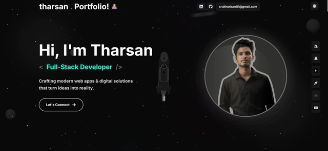

## Hi 👋, I'm Yoganathan Arultharisan

<!-- Replace the GIF with a video thumbnail linking to assets/video.mp4 -->
<div align="center">
<a href="assets/video.mp4"></a>
</div>

<p align="center"><em>Full-Stack Developer & AI/ML Enthusiast — Uva Wellassa University (UWU), Sri Lanka</em></p>

<div align="center">

[](https://www.linkedin.com/in/tharisan0111/)
[](https://github.com/ThaRSan1101/ThaRSan1101)

</div>

---

### 🚀 A little more about me...

```javascript
const tharisan = {
	name: "Yoganathan Arultharisan",
	role: "Full-Stack Developer & AI/ML Enthusiast",
	university: "Uva Wellassa University (UWU), Sri Lanka",
	projects: ">=5 (academic, freelance, personal)",
	learning: ["Machine Learning", "Artificial Intelligence", "Advanced Full-Stack Development"],
	contact: {
		email: "arultharisan01@gmail.com",
	linkedin: "https://www.linkedin.com/in/tharisan0111/",
		github: "https://github.com/ThaRSan1101",
		whatsapp: "https://wa.me/94715112782"
	},
	skills: {
		languages: ["C", "Java", "JavaScript", "HTML", "CSS", "PHP", "SQL"],
		frameworks: ["React", "Node.js", "Tailwind CSS", "Bootstrap"],
		tools: ["MySQL", "Git", "Linux", "Docker", "AWS", "Vercel", "Netlify", "Postman"]
	},
	architecture: ["Microservices", "Event-Driven Systems"],
	challenge: "Building intelligent full-stack systems with AI integration"
}
```

 <em><b>I enjoy meeting new people</b> — feel free to say hi!</em>

---

### 📊 GitHub Overview

<table border="0" cellpadding="0" cellspacing="0"><tr>
<td valign="top"> 


</td>
<td valign="top"> 


</td>
</tr></table>


